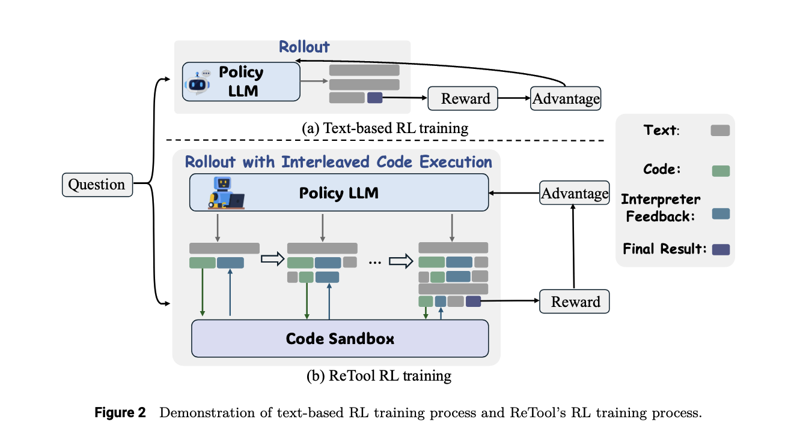
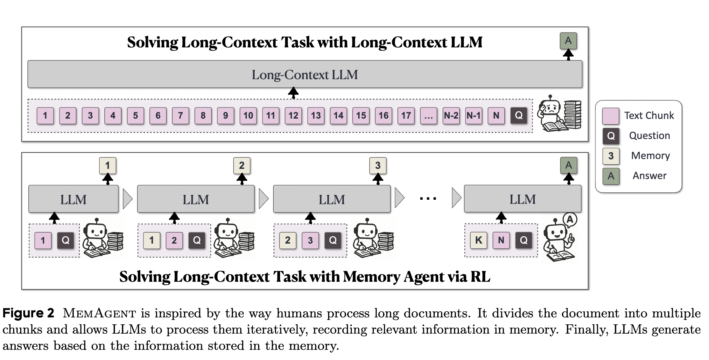
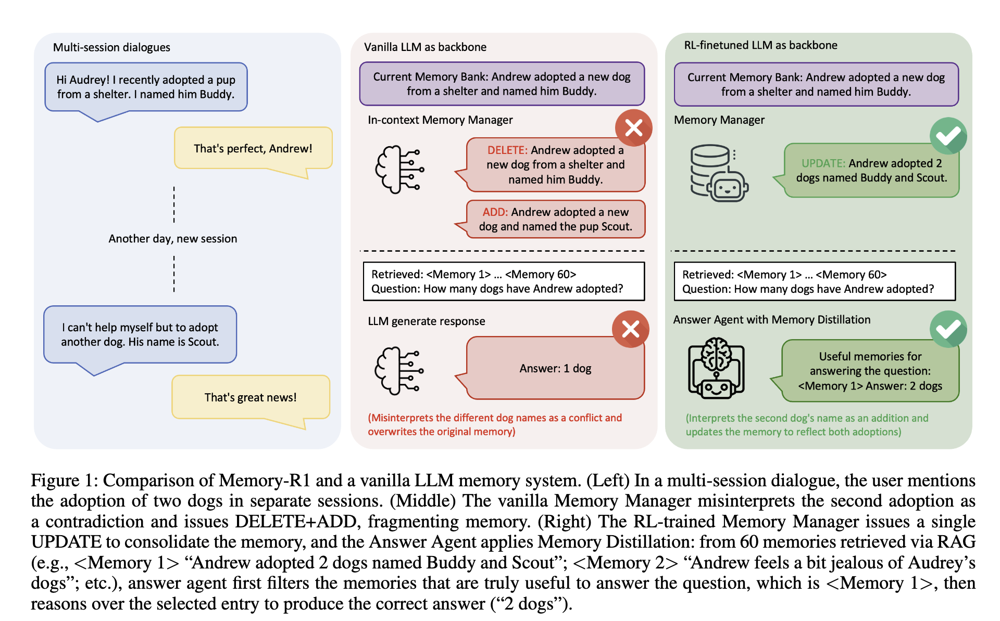

## はじめに
この記事ではLLM研究において盛り上がりを見せているAgentic Reinforcement Learningのサーベイ論文
「The Landscape of Agentic Reinforcement Learning for LLMs: A Survey」^[[The Landscape of Agentic Reinforcement Learning for LLMs: A Survey](https://arxiv.org/abs/2509.02547)]を読んで私が理解した内容について紹介します。

- RLアルゴリズム(REINFORCE,PPO,GRPOなど)については他の多くの記事ですでに情報があるためこの記事では説明は省略します
- 論文中で触れられている全ての研究を紹介することはできないので、各トピックにおいて私が重要と思ったものをピックアップして紹介します

## LLMに強化学習を適用する歴史的背景
Agentic RLの話に入る前に、まずはLLMに対して強化学習がどのように適用されてきたかを振り返ってみようと思います。

### 選好チューニング
2022年11月のChatGPTの登場によりLLMを用いた対話システムが急速に普及しました。LLMは通常Webから収集された大量のテキストコーパスによる事前学習を実施した後に、人間の指示に従って応答するような振る舞いを獲得するため指示チューニング(Instruction Tuning)を実施します。これは人間が生成したプロンプトと応答ペアに基づいてモデルを教師あり学習するものです。
しかしこれだけでは、応答が人間の好みに沿わない場合や、倫理的に問題のある内容を生成する場合があります。そこで強化学習を用いてモデルの応答を人間の好みにより近づける手法が研究されています。
RLHF(Reinforcement Learning from Human Feedback)はその代表例で、LLMの応答に対する人間のフィードバックを元に教師あり学習した報酬モデルを用意し、LLMの応答に対して報酬モデルで報酬を与え強化学習を実施します。これにより人間の好みに沿った応答を生成する能力が向上します。
RLHFの他にもLLMの自己生成データを用いて好ましい出力を強化するRLAIF(Reinforcement Learning with AI Feedback)や報酬モデルや強化学習の枠組みを利用せずに人間の好みを直接学習するDPO(Direct Preference Optimization)などがあります。これらの選好チューニングを目的とした強化学習をこの論文では従来のRLと位置付けています。この記事ではこれらを総称してPBRFT(Preference Based Reinforcement Fine Tuning)と呼ぶことにします。

### 推論能力の向上
初期の強化学習のLLM適用は選好チューニングが主でしたが2024年9月にOpenAIから初の推論モデルであるOpenAI o1が発表されました。強化学習を利用することで長考して答えを導き出す能力を向上させたことがシステムカード^[[OpenAI o1 System Card](https://cdn.openai.com/o1-system-card-20241205.pdf)]で報告されています。このレポートでは具体的な強化学習の手法についての情報公開されていませんでしたが、2025年1月に登場したDeepSeek-R1^[[DeepSeek-R1: Incentivizing Reasoning Capability in LLMs via Reinforcement Learning](https://arxiv.org/abs/2501.12948)]によって、価値評価モデルを不要とするGRPOというRLアルゴリズムや答えが一意に定まる問題設定に対してルールベース報酬を利用することで報酬モデルを取り除くなど、具体的な手法とともに強化学習がLLMの推論能力と汎化能力を飛躍的に向上させることが示されました。これを機にアライメント目的であった従来の利用方法から、LLMの能力を向上させる目的で強化学習を適用する研究が活発化し、この流れがこの記事の主題でもあるAgentic RLに繋がってきています。

### ツール利用性能の向上
2025年2月に発表され今では当たり前となっているweb検索を使ってレポートを作成してくれるDeep Researchにも強化学習が適用されていることが報告されています。
またOpen AI o1の後継であるo3モデルでは、推論能力に加えて、いつ、どのようにツールを使用するかといったルール利用についても強化学習によって性能向上していることが報告されています。

  
このようにLLMに対する強化学習の適用は選好チューニングからLLMの推論能力の向上、そしてエージェントとしてのツール利用性能の向上へと広がりを見せています。これらの歴史的背景を踏まえた上で、Agentic RLについて紹介します。

## Agentic RLとは
本論文におけるAgentic RLの定義を引用します。

>Agentic Reinforcement Learning（Agentic RL）とは、LLM（大規模言語モデル）を、単発の出力整合性やベンチマーク性能の最適化を目的とした静的な条件付き生成モデルとして扱うのではなく、**逐次的な意思決定ループの中に埋め込まれた「学習可能な方策」**として捉えるパラダイムを指します。この枠組みでは、強化学習（RL）によってモデルに**計画立案・推論・ツール利用・記憶保持・自己省察**などの自律的なエージェント的能力を与えることで、部分的に観測可能で動的な環境において、**長期的な認知的・対話的行動**が自発的に現れることを可能にします。

従来のPBRFTでは、与えられたプロンプトを状態、LLMの応答を行動とみなし、この1ステップのやり取りに対して発生する報酬を最大化する問題として定式化されています。このような設定では環境との反復的な対話や状態の変化はありません。
一方、Agentic RLではLLMを部分観測可能なマルコフ決定過程 (POMDP) 上のエージェントとして位置づけ、時間的に連続した一連の意思決定を行うよう学習します。エージェントは環境から観測を逐次受け取り、複数ステップにわたり行動を選択し、環境状態が変化するとともに断続的な報酬を獲得します。この「環境と対話しながら長期的な目標達成を目指す」という枠組みにより、LLMはただのテキスト生成器ではなく、動的環境に埋め込まれた自律エージェントとして機能します。

## PBRFTとAgentic RLの比較
強化学習はマルコフ決定過程(MDP)というフレームワークに基づいて定式化されるため、その観点で両者を比較したものが以下の表です。

### 状態 (State)
従来のLLM RLではエピソードの初期状態$s_0$がユーザープロンプト1つだけで、モデルの応答後にただちにエピソード終了します(horizon T=1)。 これに対しAgentic RLでは、環境内のあらゆる情報$s_t$に対し、エージェントには観測$ot=O(st)$が与えられます。状態はエージェントの行動に応じて遷移し、時間とともに変化し続けます(horizon T > 1)。エージェントは部分観測しか得られないため、不完全な情報下で意思決定を行う必要があります。

### 行動 (Action)
従来のLLM RLの行動はテキスト出力のみです。一方、Agentic RLでは行動空間がテキスト生成 ($A_{text}$) と環境操作 ($A_{action}$) の二種類に拡張されます。テキスト生成は人間や他のエージェントへのメッセージや思考過程(Chain of Thought; CoT)の生成が目的であり環境自体は変化させませんが、環境操作アクションではツールの呼び出し（例: `call("search", "Einstein")`）によって新しい情報を取得したり、環境内での操作（例: `move("north")`）を実行することで直接環境の状態を変更します。

### 遷移動態 (Transition)
従来のLLM RLでは行動と同時にエピソード終了となるため状態遷移はありません。一方、Agentic RLでは確率的な遷移関数 $P(s_{t+1} \mid s_t, a_t)$ に従って状態が変化します。特に環境操作アクションにより環境が変化し、またテキストアクションによって外部ツールから新情報を取得することで次状態に反映されます。環境は不確実性を伴って変化しうるため、エージェントは試行錯誤を通じて環境動態を経験的に学習していく必要があります。

### 報酬 (Reward)
従来のLLM RLでは1回の出力に対して良さを評価するスカラー報酬 $r(a)$ が与えられるのみで、中間のフィードバックはありません。一方Agentic RLではタスク達成時の報酬$ r_{\text{task}}$に加え、中間ステップでの部分的な報酬$r_{\text{sub}}(s_t,a_t)$を適宜与えることができます。例えばサブゴールの達成、ツールによる正解発見、ユニットテストのパス、定理証明の部分進展などに対しdenseな報酬を与えることで、長いタスクを途中経過も含め学習できます。報酬は人間やAIのフィードバックモデルによるスコアだけでなく、ルールベースの自動評価やシミュレータ内のスコアなど多様な設計が可能です。

### 目的関数 (Objective)
従来のLLM RLの目的関数$J_{\theta}$は単一ステップの期待報酬を最大化することでした。一方Agentic RLでは割引累積報酬$J_{agent} = E_{\tau \sim \pi_\theta}[ \sum_{t=0}^{T-1} \gamma^t R_{agent}(s_t,a_t) ]$を最大化する長期最適化問題となります。エージェントは将来の利益も考慮した戦略を学習する必要があり、これにより短期的には不利でも将来的に有利な行動を選ぶことが求められます。

このように両者を比較してみるとAgentic RLはLLM以前のゲームAIなどで用いられてきた元来の強化学習の枠組みと同じ定式化になっていることが理解できます。
どちらのアプローチもLLMの性能を向上させるためにRLを活用しますが、その根底にある仮定、タスク構造、および意思決定の粒度において根本的に異なります。下の図はPBRFTからAgentic RLへのパラダイムシフトを示しています。

## RLアルゴリズム

## エージェントのコア能力と強化学習による最適化
Agentic RLにおいて鍵となるのは、LLMエージェントにどのような能力を持たせそれらを強化学習で最適化するかということです。この論文ではコア能力として以下の6つの能力が挙げられています。ここではそれぞれ能力についてRLがどのように活用されているかを紹介していきます。

- Planning（計画）
- Tool Use（ツール使用）
- Memory（記憶）
- Self-Improvement（自己改善）
- Reasoning（推論）
- Perception（知覚）

### プランニング（計画）
プランニングとは、ゴールを達成するための行動シーケンスを熟考する能力です。人間の問題解決でも核心となるスキルであり、LLMエージェントにとっても **「いつ・何を・どの順序で行うか」** を決定する重要な役割を果たします。初期のLLMエージェントでは、与えられたタスクをいきなり解答させるのではなく、例えばReActのようにLLM自身に思考プロセス（Chain-of-Thought）と行動候補を逐次生成させるプロンプト手法が試みられました。しかしプロンプト工夫やFew-shot例に基づくこれらの静的プランニングでは、新しい状況への適応や試行錯誤による戦略改善は困難でした。 強化学習はこの問題に対し、プランニング戦略を経験から学習させるというアプローチを提供します。Agentic RLにおけるプランニング能力の強化には大きく2つのパラダイムがあります:
#### 外部ガイドとしてのRL
LLMが生成する計画の候補を評価する外部の探索アルゴリズムをRLで学習する方法です。例えばMonte Carlo Tree Search (MCTS)のような探索を用いて計画候補を立案する場合に、LLMは次の一手を提案する役割を担い、RLで学習した報酬モデル（価値関数）が各計画の見込みを評価して探索を行います。

RAPやLATSといった手法では、LLMのプラン候補生成に対しRLベースのヒューリスティック評価を組み合わせ、探索効率を高めています。この設定では、LLM自体の内部構造は変えずに、外部のRLエージェント（報酬モデルなど）がプラン選択を誘導する形になります。
- RAP
- LATS

#### 内部ドライバーとしてのRL
LLM自身を計画生成ポリシーと見立てて直接強化学習で最適化する方法です。こちらはLLMエージェントが環境と試行錯誤する中で、内在的にプランニング能力を向上させるアプローチです。具体的には、うまくいった行動系列と失敗した系列を比較し、RLHFに類似した手法（例えばDPOによる好ましいプランの強化）でLLMを微調整したり、環境とのインタラクションを通じた終生学習でスキルライブラリを拡充するといった取り組みがあります。代表例としてVOYAGERでは、Minecraftのような環境内で試行錯誤しながら獲得したスキル（コードスニペット）を蓄積・改善することで、次第に長期的なプランニングが向上していく様子が報告されています。この内部ドライバー型のRLにより、LLMは静的なプラン生成器から適応的に進化するプランナーへと変貌し、未知の課題にも徐々に対応できるようになります。
これら外部ガイドと内部ドライバーの融合も将来的な展望として期待されています。最終的には、LLMエージェントが高速な直感的プランニングと慎重な探索的プランニングを統合し、自律的にプランニング戦略自体をメタ学習できることが目標です。その実現には、いつどこまで探索するか、どの程度深く熟考するかといったメタ決定を含めて強化学習で最適化することが求められます。

- AdaPlan
- PilotRL
- Voyager
- ETO

### ツール使用（Tool Use）

ツール使用は、LLMエージェントが外部の情報源やAPI、計算資源などを呼び出して活用する能力です。検索エンジンでの情報取得や電卓・コード実行、他のモデルへのクエリなど、タスク達成に必要なあらゆる外部ツールとのインタラクションを含みます。初期のLLMエージェントではReAct手法に見られるように、思考とツールアクションを交互に出力するプロンプトスタイルでツール使用を実現しました。またToolformerのように、モデル自身にAPI呼び出し箇所を学習させる自己教師ありのファインチューニングも行われました。しかし、これらはいずれも模倣学習的アプローチであり、決められたパターンのツール使用を反復するだけで、戦略的な柔軟性や誤りからの回復能力は限定的でした。 Agentic RLの導入によって、ツール使用は静的模倣から結果重視の最適化へと進化します。強化学習によりエージェントは **「どのタイミングで、どのツールを、どう使うか」** を試行錯誤から学び取れるようになります。発展の流れは大きく3段階あります

#### 単発のツール呼び出し (ReActスタイル)
初期段階では、LLMが思考の途中で例えば「Search(query)」のような一回のツールコールを挿入し、得られた結果をもとにまた思考・回答する、といった流れでした。これはプロンプト工夫や**教師ありファインチューニング(SFT)**で実現され、人間のデモに基づく決まりきったツール使用シーケンスの模倣が中心でした。
- ReAct
- Toolformer

#### ツール統合型推論 (Tool-Integrated Reasoning, TIR)
次の段階では、ツール使用をLLMの認知ループに深く組み込み、複数ターンにわたってツールを使いこなすTIRシステムが登場しました。ここでは強化学習が導入され、どの局面でツールを呼ぶか、得た情報をどう活用するかを報酬に基づき学習します。例えばReToolやToolRLといった研究では、最終タスクの成果に対する報酬を設定し、エージェントがツール呼び出しの頻度や内容を自律的に最適化しています。これにより固定スクリプトではなく、状況に応じてツール戦略を変える適応性が生まれました。
- OpenAI o3,o4,DeepResearch
s OTC-PO [ 8
- ReTool
- AutoTIR
- VTool-R1
- DeepEyes
- Pixel-Reasoner
- Agentic Reasoning
- ARTIST
- ToRL

今日では、そのようなツール統合型推論は高度なエージェントモデルのベースライン機能となっています。OpenAIのDeepResearchおよびo3、Kimi K2、Qwen QwQ-32B、Zhipu GLM Z1、Microsoft rStar2-Agent、Meituan LongCatといった成熟した商用およびオープンソースシステムは、これらのRLで磨かれた戦略を日常的に組み込んでおり、ツール拡張型AIにおける結果駆動型最適化の重要性を強調しています。

#### 長期的・マルチステップのツール使用
将来的な課題として、さらに長い地平でのツール連携や、複数ツールの動的組み合わせがあります。長期的ツール使用では、中間成果に対して与えられる報酬を工夫し、例えば一連のウェブ検索・計算・API呼び出しを経て最終目標を達成するまでのプロセス全体を強化学習で最適化する必要があります。クレジット割当の難しさがありますが、これが可能になればエージェントは複雑なツールチェーンを自律的に学び、未知のタスクにも柔軟に対処できるようになると期待されています。

### メモリ（長期・短期記憶）
メモリはエージェントが過去に得た情報や経験を保持・再利用する能力です。LLM自身のコンテキストウィンドウは有限であるためエージェントとして長期間活動するには外部記憶（ナレッジベースや対話履歴）を活用する必要があります。この課題に対し、従来はRetrieval-Augmented Generation (RAG)による検索・参照や、会話履歴を毎回プロンプトに詰め込むウィンドウ拡張などが用いられてきました。しかし、静的な検索戦略や手動で設計されたメモリ更新では、タスクに最適な情報検索・忘却ができない場合があります。 Agentic RLでは、**どの情報を記憶し、何を思い出すべきか**を強化学習で学習させます。例えば、強化学習の報酬として「質問に正答できたか」や「タスクを効率的に達成できたか」を与えることで、エージェントは有用な知識を引き出す振る舞いを強化できます。具体的なアプローチには以下のようなものがあります。

#### RAG形式のメモリ
RAGの基本的な目的は外部のデータストアから類似性に基づいて情報(メモリ)を検索することです。
メモリを管理する機能としてRLが導入されました。prospectで提案されたフレームワークでは
prospectで提案されたフレームワークではRLポリシーが将来の反省（多段階の要約）と過去の反省（取得結果の強化）を通じて取得行動を調整します。

https://arxiv.org/abs/2503.08026

ただし記憶媒体自体は書き込みが行われない静的なものとなっていました。
Memory-R1はメモリ拡張を行うエージェントとして機能する。

#### Token-levelメモリ
その後RAGのように外部メモリに依存することなく依存することなく、LLM自身が学習可能なメモリコントローラを備えたモデルが導入されました。これらのアプローチはエージェントが自身のメモリバンクを自律的に管理することを可能にし、長文コンテキスト理解、継続的な適応、自己改善において著しい向上をもたらします。
- 明示的,暗黙的なトークンはRLの話でそこまで重要じゃないので省略

#### 構造化メモリ
最近のトレンドは、フラットなトークンシーケンスを超えて情報を整理・符号化する構造化メモリ表現へと移行しています。
代表的な例としては、
- Zep https://arxiv.org/abs/2501.13956 [125]における時間的知識グラフ
- A-MEM https://arxiv.org/abs/2502.12110 [126]におけるアトミックメモリノート
- G-Memory https://arxiv.org/abs/2506.07398 [127]
- Mem0 https://arxiv.org/abs/2504.19413 [128]における階層的なグラフベースのメモリ設計が挙げられます。
これらはまだRLが使われていない領域

### 自己改善・自己反省（Self-Improvement / Reflection）
自己改善（Self-Improvement）とは、エージェントが自身の出力や行動を振り返り、誤りを訂正したり戦略を洗練したりする能力です。大規模言語モデルにはしばしば自己反省 (self-reflection)や自己検証のプロンプトを与えることで回答精度を上げる手法がありますが、Agentic RLではこれをエージェントの内部ループに組み込み、学習によって最適化します。 具体的には、LLMエージェントがあるタスクを実行した後で自分の行動を振り返り、「どこが良くなかったか」「次はどうすべきか」を考えるプロセスがあります。たとえばコード生成エージェントなら、出力したコードをテストしてバグがあれば自己修正案を考えるでしょう。この内省プロセス自体を強化学習でトレーニングし、より効果的な自己修正ができた場合に高い報酬を与えるという方法が取れます。 研究例としては、エージェントにCritic (批評家)役のモデルを持たせて自分の回答を評価・改善させる枠組みや、自己発問して再回答する手法（Self-Ask）などがあります。Agentic RLでは、こうした二段構えの推論において批評フェーズの品質や再回答の有用性に報酬を与えます。これにより、単に静的に自己反省させるよりも、実際にパフォーマンスが向上する自己改善パターンをエージェントが獲得できます。 また、長期的にはエージェントが自分の知識やスキルそのものを改善していく仕組み（自己進化）も視野に入ります。例えば、新しいタスクに直面したときに報酬を元に方針転換したり、自分のネットワークパラメータを追加学習して強化するようなメタ学習的挙動です。現時点では初歩的な段階ですが、Agentic RLはこのような自己改善能力を促進する鍵となると期待されています。

研究例
- 

3パターンある
- fine tuningなしで言語ベースで反省を行う
- fine tuningしてLLMの出力自体に内省が含まれるようにする
- 反省、推論、タスク生成を一連の流れとして強化学習で最適化する(ボリューム多い)
    - R-zero: モンテカルロ木探索（MCTS）を利用して推論ツリーを探索し、探索結果を用いてポリシーLLM（アクター）と価値LLM（クリティック）の両方をゼロから繰り返し訓練します
    - ISC: 「想像、探索、批判」のサイクルを運用します。ここでは、エージェントが潜在的な解決策パスを生成し、探索アルゴリズムを使ってそれらを探索し、最終的な答えを生成する前にクリティックを適用して推論戦略を洗練します。
    - Absolute Zero：自身のタスクを提案し、解決策を試み、実行を通じてそれらを検証し、結果ベースの報酬を使ってポリシーを洗練することで、これを例示しています
    - Self-Evolving Curriculum: 問題選択自体を非定常バンディットタスクとして捉えることでこのプロセスを強化し、エージェントが時間の経過とともに学習利益を最大化するカリキュラムを戦略的に生成できるようにします
    - TTRL: この原則を単一の問題へのオンザフライ適応に適用します。テスト時には、実行ベースの報酬を使って、手元の特定のタスクのためにエージェントのポリシーの一時的なコピーを迅速にファインチューニングします

### 推論（Reasoning）
推論（Reasoning）は、与えられた情報から論理的に結論を導くプロセスです。従来のLLMにおいてもChain of Thought(CoT)プロンプティングなどの技術 によって推論する能力を持ちますが、

代表的な例としてOpenAI o1,o3やDeepSeek-R1があります。これらのモデルは強化学習を通じて複雑な数学的問題や論理パズルを解く能力が向上したことが報告されています。 

### 知覚（Perception）
知覚（Perception）は、エージェントがテキスト以外のモダリティ（画像、音声、実世界のセンサデータなど）を理解・認識する能力です。従来のLLMは言語モデルなのでテキスト以外は直接扱えませんでしたが、Agentic RLではマルチモーダルな環境にエージェントを配置し、視覚や音声の入力に対応できるよう強化学習でトレーニングする試みが行われています。 例えば視覚エージェントでは、画像キャプション生成や画像質問応答(VQA)をLLMに行わせつつ、回答の正確さを報酬として学習させます。またロボットアームの制御のようなエンボディドな知覚行動では、カメラ映像から得た情報を基に次の動作を決め、その結果うまく物体操作ができれば報酬を与える、といった形で視覚-行動ポリシーを訓練します。 知覚分野でのAgentic RLの課題は、高次元入力と長い試行による学習効率の低下です。シミュレータを用いた大量のトライアルが必要になる場合が多く、現実の物理実験ではコストが高すぎます。そこで、シミュレーションと実環境を組み合わせたトレーニング（シミ2リアル）や、報酬設計の工夫によるサンプル効率向上などが研究されています。これらが進展すれば、将来的には視覚・音声・触覚といったあらゆるモダリティを統合した汎用知覚エージェントが実現するでしょう。

## 主な応用分野と代表的な手法
Agentic RLはさまざまなタスク領域で応用が始まっています。本節では、特に注目される応用分野と代表的な手法・研究例を紹介します。分野ごとに、LLMエージェントがどのような問題を解決し、強化学習がどのように活用されているかを解説します。

