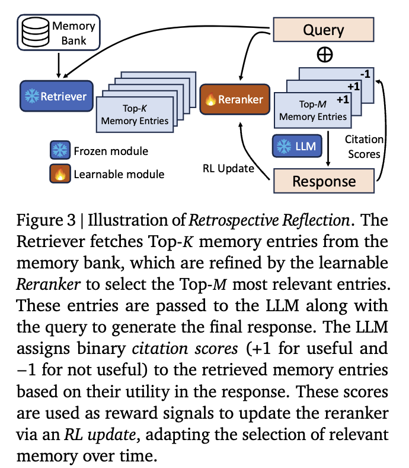

## はじめに
この記事ではLLM研究において盛り上がりを見せているAgentic Reinforcement Learningのサーベイ論文
「The Landscape of Agentic Reinforcement Learning for LLMs: A Survey」^[[The Landscape of Agentic Reinforcement Learning for LLMs: A Survey](https://arxiv.org/abs/2509.02547)]を読んで私が理解した内容について紹介します。

- RLアルゴリズム(REINFORCE,PPO,GRPOなど)については他の多くの記事ですでに情報があるためこの記事では説明は省略します
- 論文中で触れられている全ての研究を紹介することはできないので、各トピックにおいて私が重要と思ったものをピックアップして紹介します

## LLMに強化学習を適用する歴史的背景
Agentic RLの話に入る前に、まずはLLMに対して強化学習がどのように適用されてきたかを振り返ってみようと思います。

### 選好チューニング
2022年11月のChatGPTの登場によりLLMを用いた対話システムが急速に普及しました。LLMは通常Webから収集された大量のテキストコーパスによる事前学習を実施した後に、人間の指示に従って応答するような振る舞いを獲得するため指示チューニング(Instruction Tuning)を実施します。これは人間が生成したプロンプトと応答ペアに基づいてモデルを教師あり学習するものです。
しかしこれだけでは、応答が人間の好みに沿わない場合や、倫理的に問題のある内容を生成する場合があります。そこで強化学習を用いてモデルの応答を人間の好みにより近づける手法が研究されています。
RLHF(Reinforcement Learning from Human Feedback)はその代表例で、LLMの応答に対する人間のフィードバックを元に教師あり学習した報酬モデルを用意し、LLMの応答に対して報酬モデルで報酬を与え強化学習を実施します。これにより人間の好みに沿った応答を生成する能力が向上します。
RLHFの他にもLLMの自己生成データを用いて好ましい出力を強化するRLAIF(Reinforcement Learning with AI Feedback)や報酬モデルや強化学習の枠組みを利用せずに人間の好みを直接学習するDPO(Direct Preference Optimization)などがあります。これらの選好チューニングを目的とした強化学習をこの論文では従来のRLと位置付けています。この記事ではこれらを総称してPBRFT(Preference Based Reinforcement Fine Tuning)と呼ぶことにします。

### 推論能力の向上
初期の強化学習のLLM適用は選好チューニングが主でしたが2024年9月にOpenAIから初の推論モデルであるOpenAI o1が発表されました。強化学習を利用することで長考して答えを導き出す能力を向上させたことがシステムカード^[[OpenAI o1 System Card](https://cdn.openai.com/o1-system-card-20241205.pdf)]で報告されています。このレポートでは具体的な強化学習の手法についての情報公開されていませんでしたが、2025年1月に登場したDeepSeek-R1^[[DeepSeek-R1: Incentivizing Reasoning Capability in LLMs via Reinforcement Learning](https://arxiv.org/abs/2501.12948)]によって、価値評価モデルを不要とするGRPOというRLアルゴリズムや答えが一意に定まる問題設定に対してルールベース報酬を利用することで報酬モデルを取り除くなど、具体的な手法とともに強化学習がLLMの推論能力と汎化能力を飛躍的に向上させることが示されました。これを機にアライメント目的であった従来の利用方法から、LLMの能力を向上させる目的で強化学習を適用する研究が活発化し、この流れがこの記事の主題でもあるAgentic RLに繋がってきています。

### ツール利用性能の向上
2025年2月に発表され今では当たり前となっているweb検索を使ってレポートを作成してくれるDeep Researchにも強化学習が適用されていることが報告されています。
またOpen AI o1の後継であるo3モデルでは、推論能力に加えて、いつ、どのようにツールを使用するかといったルール利用性能についても強化学習によって性能向上していることが報告されています。

  
このようにLLMに対する強化学習の適用は選好チューニングからLLMの推論能力の向上、そしてエージェントとしてのツール利用性能の向上へと広がりを見せています。これらの歴史的背景を踏まえた上で本題であるAgentic RLについて紹介します。

## Agentic RLとは
まずは本論文におけるAgentic RLの定義を引用します。

>Agentic Reinforcement Learning（Agentic RL）とは、LLM（大規模言語モデル）を、単発の出力整合性やベンチマーク性能の最適化を目的とした静的な条件付き生成モデルとして扱うのではなく、逐次的な意思決定ループの中に埋め込まれた「学習可能な方策」として捉えるパラダイムを指します。この枠組みでは、強化学習（RL）によってモデルに計画立案・推論・ツール利用・記憶保持・自己省察などの自律的なエージェント的能力を与えることで、部分的に観測可能で動的な環境において、長期的な認知的・対話的行動が自発的に現れることを可能にします。

従来のPBRFTでは、与えられたプロンプトを状態、LLMの応答を行動とみなし、この1ステップのやり取りに対して発生する報酬を最大化する問題として定式化されています。このような設定では環境との反復的な対話や状態の変化はありません。
一方、Agentic RLではLLMを部分観測可能なマルコフ決定過程 (POMDP) 上のエージェントとして位置づけ、時間的に連続した一連の意思決定を行うよう学習します。エージェントは環境から観測を逐次受け取り、複数ステップにわたり行動を選択し、環境状態が変化するとともに報酬を獲得します。この「環境と対話しながら長期的な目標達成を目指す」という枠組みにより、LLMはただのテキスト生成器ではなく、動的環境に埋め込まれた自律エージェントとして機能します。

## PBRFTとAgentic RLの比較
強化学習はマルコフ決定過程(MDP)というフレームワークに基づいて定式化されるため、その観点で両者を比較したものが以下の表です。

### 状態 (State)
従来のPBRFTではエピソードの初期状態$s_0$がユーザープロンプト1つだけで、モデルの応答後にただちにエピソード終了します(horizon T=1)。 これに対しAgentic RLでは、環境内の時間ステップtにおける状態$s_t$から観測$o_t=O(s_t)$がエージェントに与えられます。状態および観測はエージェントの行動に応じて遷移し、時間とともに変化します(horizon T > 1)。
例えばResearchエージェントの場合、外部から得られる情報が観測に相当します。

### 行動 (Action)
従来のPBRFTの行動はテキスト出力のみです。一方、Agentic RLでは行動空間がテキスト生成 ($A_{text}$) と環境操作 ($A_{action}$) の二種類に拡張されます。
GUIを操作するエージェントの場合、テキスト生成は人間や他のエージェントへのメッセージ、あるいは思考過程(Chain of Thought; CoT)の生成に該当し、環境操作はクリックやスクロール、フォーム入力などのGUI操作に相当します。

### 遷移関数 (Transition)
従来のPBRFTでは1回の行動(テキスト生成)と同時にエピソード終了となるため状態遷移はありません。一方、Agentic RLでは確率的な遷移関数 $P(s_{t+1} \mid s_t, a_t)$ に従って状態が各ステップで変化します。
例えばエージェントが人間に対して質問を行うアクションをとったとき、人間の回答は決定的ではないため次の状態は確率的に変化します。

### 報酬 (Reward)
従来のLLM RLでは1回の出力に対して良さを評価するスカラー報酬 $r(a)$ が与えられるのみで、中間のフィードバックはありません。一方Agentic RLではタスク達成時の報酬$ r_{\text{task}}$に加え、中間ステップでの部分的な報酬$r_{\text{sub}}(s_t,a_t)$を適宜与えることができます。
$$
\mathcal{R}_{\text{agent}}(s_t, a_t) = 
\begin{cases} 
    r_{\text{task}} & \text{on task completion,} \\
    r_{\text{sub}}(s_t, a_t) & \text{for step-level progress,} \\
    0 & \text{otherwise,}
\end{cases}
$$
例えばサブゴールの達成、ツールを正しく使用すること、ユニットテストのパス、数学の定理証明の部分進展などに対し部分報酬を与えることで、長いタスクを途中経過も含め学習できます。報酬は人間やAIのフィードバックモデルによるスコアだけでなく、ルールベースの自動評価やシミュレータ内のスコアなど多様な設計が可能です。

### 目的関数 (Objective)
従来のPBRFTの目的関数$J_{\theta}$は単一ステップの期待報酬を最大化することでした。一方Agentic RLでは割引累積報酬$J_{agent} = E_{\tau \sim \pi_\theta}[ \sum_{t=0}^{T-1} \gamma^t R_{agent}(s_t,a_t) ]$を最大化する長期最適化問題となります。エージェントは将来の利益も考慮した戦略を学習する必要があり、これにより短期的には不利でも将来的に有利な行動を選ぶことが求められます。

どちらのアプローチもLLMの性能を向上させるためにRLを活用しますが、その根底にある仮定、タスク構造、および意思決定の粒度において根本的に異なります。下の図はPBRFTからAgentic RLへのパラダイムシフトを示しています。

## エージェントのコア能力と強化学習による最適化
Agentic RLにおいて鍵となるのは、LLMエージェントにどのような能力を持たせそれらを強化学習で最適化するかということです。この論文ではコア能力として以下の6つの能力が挙げられています。ここではそれぞれ能力についてRLがどのように活用されているかを紹介していきます。

- Planning（計画）
- Tool Use（ツール使用）
- Memory（記憶）
- Self-Improvement（自己改善）
- Reasoning（推論）
- Perception（知覚）

### プランニング（計画）
プランニングとは、ゴールを達成するための行動系列を計画する能力のことです。「いつ・何を・どの順序で行うか」を決定する
- 初期のLLMエージェントでは、与えられたタスクをいきなり解答させるのではなく、例えばReActのようにLLM自身に思考プロセス（Chain-of-Thought）と行動候補を逐次生成させるプロンプト手法が試みられました。
しかしプロンプト工夫やFew-shot例に基づくこれらの静的プランニングでは、新しい状況への適応や試行錯誤による戦略改善は困難でした。 強化学習はこの問題に対し、プランニング戦略を経験から学習させるというアプローチを提供します。
Agentic RLにおけるプランニング能力の強化には大きく2つのパラダイムがあります:

### ツール使用（Tool Use）

ツール使用は、エージェントが外部の情報源やAPI、計算資源などを呼び出して活用する能力です。検索エンジンでの情報取得や電卓・コード実行、他のモデルへのクエリなど、タスク達成に必要なあらゆる外部ツールとのインタラクションを含みます。強化学習によりエージェントは **「どのタイミングで、どのツールを、どう使うか」** を試行錯誤から学び取れるようになります。発展の流れは大きく3段階あります。

#### ReAct形式のツール利用
エージェントのツール利用について初期はReActのようなプロンプトベースの手法やToolformerのように教師ありファインチューニング(SFT)によって、ツール利用プロセスを模倣しツール利用能力を獲得する手法が試みられました。
しかし、SFTはいわゆる模倣学習であるため未知のツールへの汎化が難しく柔軟性に欠けます。またツール利用履歴データを用意するコストもあることから強化学習を用いてアウトカムベースでツール利用戦略を学習する試みが始まりました。

#### ツール統合型RL (Tool-Integrated RL)
次の段階では、ツール使用をLLMの認知ループに深く組み込み、複数ターンにわたってツールを使いこなすエージェントシステムが登場しました。ここでは強化学習が導入され、どの局面でツールを呼ぶか、得た情報をどう活用するかを報酬に基づき学習します。
例えばReToolでは複雑な数学的問題タスクに対してDeepSeek-R1のようにテキストベースのRLを行うのではなく、Pythonのコードインタプリタをツールとして活用する能力をRLによって学習することで正解率を向上させています。この研究ではSFTで基本的なツール利用能力を学習後にRLで最終的な回答に対する正解報酬によってツール利用戦略を学習しました。

ほぼ同時期に発表されたARTISTも似たようなアプローチをとっていますが、ARTISTは数学的タスクだけでなく、BFCL v3や τ -benchといったマルチステップのFunction Callingが必要となるベンチマークでの評価を行っています。
BFCL v3は、旅行予約や車両制御など多様な分野で、エージェントがツールを使いこなす能力を測るベンチマークです。特に、情報が不足していたり、そもそも実行不可能な要求をされたり、会話が長くて複雑だったりする困難な状況への対応力が試されます。
τ-benchは、航空や小売の分野で、ユーザーとの現実的な会話をシミュレートするベンチマークです。エージェントは、定められたルールに従ってドメイン固有のAPIを使い、最終的に予約情報といったシステムの状態を目標通りに更新するタスクの完遂能力を試されます。これらのタスクに対して推論, ツール利用を繰り返し行いながらタスクに対する最終的な回答を生成し、最終回答の正解報酬に加えて、ツール呼び出し成功報酬によって、いつどのツールを使うかと良いかをRLで学習しています。

上記で示した強化学習を利用したツール統合型推論は、研究領域だけでなくChatGPT Deep ResearchやOpenAI o3のような商用システムにもすでに採用されています。

#### 長期的・マルチステップのツール使用
今後の研究の方向性として、長期的なステップでのツール連携や、複数のツールの組み合わせによる複雑なタスク解決が挙げられています。

Feng et al. (2025)は、LLM エージェントが長期的で複雑なマルチターンタスクを遂行できるように訓練するための新しい強化学習（RL）アルゴリズム「Group-in-Group Policy Optimization (GiGPO)」を提案しています。
DeepSeekが発表したGRPOは数学の問題のような1問1答型のタスクに対して有効なRLアルゴリズムですが、一連の行動すべてをまとめて評価するためマルチステップのタスクに対しては個々のステップの良し悪しを判断するのが難しいという課題があります。GiGPOではこの問題に対処するためにエピソードレベルとステップレベルの2つグループ構造でadvantage(行動の良し悪しの基準)を計算するという手法を採用しています。

### メモリ（長期・短期記憶）
メモリはエージェントが過去に得た情報や経験を保持・再利用する能力です。LLM自身のコンテキストウィンドウは有限であるためエージェントとして長期間活動するには外部記憶（ナレッジベースや対話履歴）を活用する必要があります。この課題に対し、従来はRetrieval-Augmented Generation (RAG)による検索・参照や、会話履歴を毎回プロンプトに詰め込むウィンドウ拡張などが用いられてきました。しかし、静的な検索戦略や手動で設計されたメモリ更新では、タスクに最適な情報検索・忘却ができない場合があります。 Agentic RLでは、**どの情報を記憶し、何を思い出すべきか**を強化学習で学習させます。例えば、強化学習の報酬として「質問に正答できたか」や「タスクを効率的に達成できたか」を与えることで、エージェントは有用な知識を引き出す振る舞いを強化できます。具体的なアプローチには以下のようなものがあります。

#### RAG形式のメモリ
RAG形式の検索メカニズムを強化学習で最適化するアプローチとして、Tan et al. (2025)が提案したReflective Memory Management (RMM)における後方リフレクション（Retrospective Reflection）が挙げられます。この手法は、従来のRAGが持つ「検索方法が固定的で、対話の文脈に応じて最適化されない」という課題に対処するものです。
1. Retrieverによって検索された記憶の候補をRerankerが絞り込む
2. LLMがその記憶を用いて応答を生成する際、実際にどの記憶を引用したかを自己評価する
3. 引用された記憶には正の報酬（+1）、されなかった記憶には負の報酬（-1）を与えてRerankerのパラメータを更新する

この一連の処理をオンライン強化学習することで、対話を通じて「LLMが本当に必要とする記憶」をより的確に選択できるよう継続的に学習しています。

上記はRAGの検索メカニズムの改善にRLを利用した例でしたが、Memory-R1はエージェントが外部メモリを管理するためにもRLを利用します。
Memory-R1は「Memory Manager」と「Answer Agent」という2つのエージェントを導入しています。
Memory Managerは、メモリのエントリを「追加（ADD）」「更新（UPDATE）」「削除（DELETE）」「何もしない（NOOP）」といったメモリ操作を学習し、Answer Agentは、取得したメモリの中から最も関連性の高いものを選択して回答を生成します。両エージェントの学習にはRLが用いられていますが特に注目すべきはMemory Managerの学習方法です。Memory Managerは自身の行動そのものに対しての報酬は与えられず、Answer Agentが正しい回答を生成できたか？という最終的なアウトカムに対して報酬が与えられ最適なメモリ操作戦略を学習します。自身の行動が他のエージェントの行動に影響を与えてその結果に基づき学習が行われるというのは強化学習ならではで面白い研究だなと思いました。

#### Token-levelメモリ
こちらはRAGのように外部メモリを利用せず、LLM自身が学習可能なメモリを備えるアプローチです。
MemAgentはLLMが非常に長いテキスト（数百万トークン）を扱えるようにすることを目的としています。人間が長い文章を読む際にメモを取るように、MemAgentはテキストをチャンクに分割して順に読み込み、固定長の「メモリ」に必要な情報を書き込みながら内容を理解していきます。このメモリ管理(限られたコンテキスト長に何を記憶させるか)を最終的なタスクの成功報酬に基づき強化学習で最適化します。MemAgentの仕組み自体も有用ですが、RLありMemAgentがRLなしMemAgentよりも性能が向上する結果となっておりRLの有用性が示されています。

### 自己改善・自己反省（Self-Improvement / Reflection）
自己改善（Self-Improvement）とは、エージェントが自身の出力や行動を振り返り、誤りを訂正したり戦略を洗練したりする能力です。LLMは自己反省や自己検証のプロンプトを与えることで回答精度を上げることも可能ですが、Agentic RLではこれをエージェントの内部ループに組み込み、学習によって最適化します。 具体的には、LLMエージェントがあるタスクを実行した後で自分の行動を振り返り、 **「どこが良くなかったか」「次はどうすべきか」** を考えるプロセスがあります。たとえばコード生成エージェントなら、出力したコードをテストしてバグがあれば自己修正案を考えるでしょう。この内省プロセス自体を強化学習でトレーニングし、より効果的な自己修正ができた場合に高い報酬を与えるという方法が取れます。 

### 自己反省を強化
Sweet RL

### 自己訓練(self training)
自己訓練では人によるラベルなしでLLMが自己改善を行います。
Absolute Zeroは人間が作成したタスクやラベルを一切使用せずLLMが自律的に自己改善を行うフレームワークです。このフレームワークではLLMが問題の提案を行うProposerと問題の解決を行うSolverの2つの役割を担います。SolverではProposerが生成した問題に正答した場合にのみ報酬1を得ます。一方、Proposerは$r_{proposer} = 1-r_{solver}$のようにSolverの報酬を小さくするような問題を提案する場合に高い報酬が与えられます。ただし問題が難しすぎたり簡単すぎると自己改善が進まないことから$r_{solver}$が0 or 1の場合はProposerの報酬も0になるような報酬設計となっています。
人間によるデータセットなしでこのような自己改善的な学習が可能になるのは非常に驚きです。なんとなくGAN(Generative Adversarial Network)に似た構造を感じます。

TTRLは正解ラベルのないデータを使って推論時（テスト時）に自己進化による性能向上を図るものです。具体的には、LLM自身が生成した複数の回答の中から多数決で最大投票の予測を正解とみなして擬似正解データを作成し、擬似正解ラベルと予測が一致しているかを報酬としてRLを行うことで、人間のラベリングなしにモデルの推論能力を向上させています。これだけ見ると単に選ばれやすい回答をより選ばれやすくなる(つまり確率分布を尖らせる)ようにFine Tuningしているだけのようにも思えますが、実験では数学のある特定のタスクでTTRLしたモデルで、異なる数学タスクに対しても性能が向上することが示されており汎化性能の向上が確認されたようです。

### 推論（Reasoning）
推論（Reasoning）は、与えられた情報から論理的に結論を導くプロセスです。従来のLLMにおいてもChain of Thought(CoT)プロンプティングなどの技術 によって推論する能力を持ちますが、

代表的な例としてOpenAI o1,o3やDeepSeek-R1があります。これらのモデルは強化学習を通じて複雑な数学的問題や論理パズルを解く能力が向上したことが報告されています。 
DeepSeek R1

Qwen3 思考調整

### 知覚（Perception）
知覚（Perception）は、エージェントがテキスト以外のモダリティ（画像、音声、実世界のセンサデータなど）を理解・認識する能力です。従来のLLMは言語モデルなのでテキスト以外は直接扱えませんでしたが、Agentic RLではマルチモーダルな環境にエージェントを配置し、視覚や音声の入力に対応できるよう強化学習でトレーニングする試みが行われています。 例えば視覚エージェントでは、画像キャプション生成や画像質問応答(VQA)をLLMに行わせつつ、回答の正確さを報酬として学習させます。またロボットアームの制御のようなエンボディドな知覚行動では、カメラ映像から得た情報を基に次の動作を決め、その結果うまく物体操作ができれば報酬を与える、といった形で視覚-行動ポリシーを訓練します。 知覚分野でのAgentic RLの課題は、高次元入力と長い試行による学習効率の低下です。シミュレータを用いた大量のトライアルが必要になる場合が多く、現実の物理実験ではコストが高すぎます。そこで、シミュレーションと実環境を組み合わせたトレーニング（シミ2リアル）や、報酬設計の工夫によるサンプル効率向上などが研究されています。これらが進展すれば、将来的には視覚・音声・触覚といったあらゆるモダリティを統合した汎用知覚エージェントが実現するでしょう。

## 主な応用分野と代表的な手法
Agentic RLはさまざまなタスク領域で応用が始まっています。本節では、特に注目される応用分野と代表的な手法・研究例を紹介します。分野ごとに、LLMエージェントがどのような問題を解決し、強化学習がどのように活用されているかを解説します。

search & research agent
search-r1